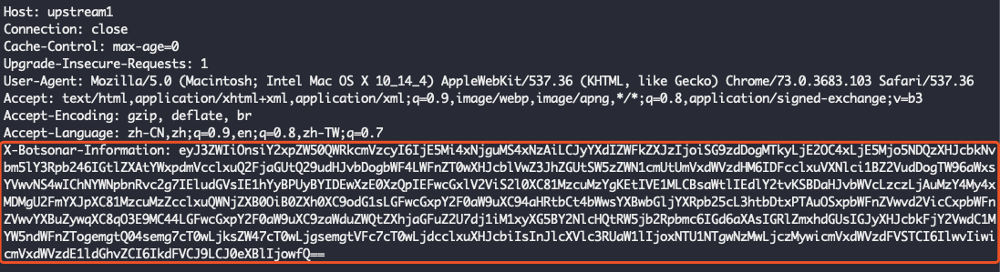
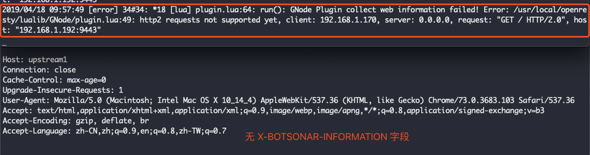

## BotSonar OpenResty 插件使用说明

- 简介

  - 该插件用于整合在 OpenResty 或者安装了 [lua 模块](https://github.com/openresty/lua-nginx-module) 的 Nginx 反向代理中，用于收集流量的 Web 端信息以提供给 GCloud 组件进行智能判断。

- 目录结构

  - GNodePlugin
    - GNode
      - plugin.lua
    - README.md

- 安装、整合及使用

  - 依赖：

    - [lua-cjson](https://github.com/openresty/lua-cjson/)，(OpenResty 内置)
    - [ngx_http_lua_module](https://github.com/openresty/lua-nginx-module)，(OpenResty 内置)

  - 安装：

    - 把 GNode 目录完整的拷贝到`/usr/local/openresty/lualib`目录下，即 `plugin.lua`的绝对路径为`/usr/local/openresty/lualib/GNode/plugin.lua`。(如果自定义了 OpenResty 的安装目录，则需根据情况调整为`(OpenResty 安装路径)/lualib/GNode`)

  - 整合：

    - 修改 OpenResty 的配置文件，在需要防护的 location 块中添加如下代码以调用该插件：

      ```nginx
      access_by_lua_block {
        local plugin = require "GNode.plugin"
        plugin.run()
      }
      ```

      示例：

      ```nginx
      server {
          listen 80;
          listen 443 ssl;
          ssl_certificate Crt/GNodeCA.crt;
          ssl_certificate_key Crt/GNodeCA.key;
        
          server_name test.com;
        
          error_log  logs/error.log  info;
      
          default_type text/html;
          client_body_buffer_size 256k;
      
          location / {
            access_by_lua_block {
              local plugin = require "GNode.plugin"
              plugin.run()
            }
            proxy_pass http://upstream1;
          }
      }
      ```

  - 使用：

    - 整合完插件之后重启 OpenResty 即可。插件正常工作的情况下，反代之后的请求(即 Web 服务器实际收到的请求)头部会携带`X-Botsonar-Information`字段，其值即为需要发送给 GCloud 判断接口的数据，字符串类型。如：

      

      此时可以在服务端取出此字段发送到指定接口并获取判断结果。

    - 错误提示：如果由于某些原因插件运行出错，反代的原始功能不会受到任何影响，但是反代之后的请求头部中不会出现`X-Botsonar-Information`字段，同时OpenResty 的 `error.log`(或者用户指定的错误日志输出)中会记录错误消息及原因，如：

      

  - 注意事项：

    - 注意涉及到的 OpenResty 的安装目录要根据实际情况进行修改
    - 本插件暂不支持 HTTP/2 协议